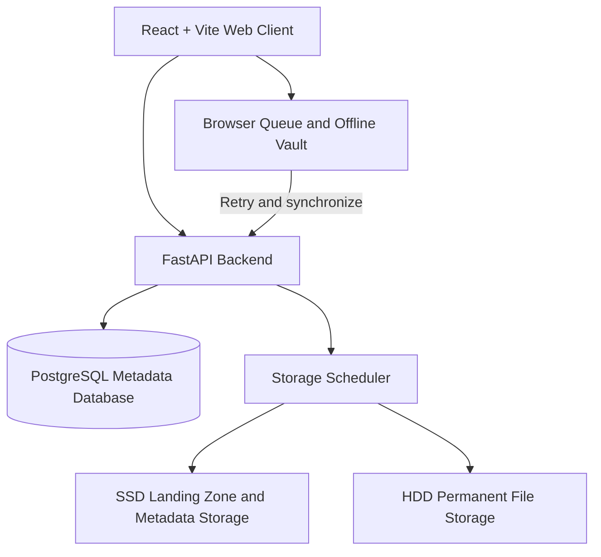

# Home Edge Cloud

A self-hosted personal cloud storage system that uses household hardware as an edge storage node. The project combines a React web client, a FastAPI backend, PostgreSQL metadata, and local SSD/HDD storage to provide authenticated file management with offline-friendly queuing and synchronization.

> **Project status:** Developed as a local working project. It has not been deployed to a public or production environment yet.

Why This Project?

Traditional cloud storage can introduce recurring costs and places user data on infrastructure controlled by a third party. Home Edge Cloud explores an alternative: keep storage in a trusted home environment while allowing users to continue using the application when the storage node or network is temporarily unavailable.

Features

- User registration and JWT-based authentication
- Password hashing and protected API routes
- Multi-user storage metadata and per-user quotas
- File upload, listing, download, and deletion workflows
- SSD-first storage selection with HDD fallback
- Storage health and capacity reporting
- Browser-based upload queue for temporary offline operation
- Automatic synchronization and retry concepts
- Priority-aware storage scheduling
- Trusted-device support
- Encrypted browser Offline Vault for selected files
- FastAPI's interactive API documentation

Architecture



The intended storage flow is:

1. A user selects a file in the browser.
2. The frontend sends it to the backend when the service is available.
3. If connectivity or storage availability is interrupted, the browser can retain queued work locally.
4. The scheduler selects available storage, preferring SSD and falling back to HDD.
5. File metadata, ownership, status, hashes, and queue state are stored in PostgreSQL.

Technology Stack

| Area | Technology |
| --- | --- |
| Frontend | React 19, Vite, JavaScript, IndexedDB |
| Backend | Python, FastAPI, Uvicorn |
| Database | PostgreSQL, SQLAlchemy |
| Validation and configuration | Pydantic and pydantic-settings |
| Authentication | JWT and password hashing |
| Storage node | Python, local SSD/HDD monitoring and scheduling |

Repository Structure

```text
home-edge-cloud/
├── backend/             FastAPI service, database models, auth, and storage logic
├── frontend/            React and Vite web application
├── storage-node/        Local storage monitoring and scheduling components
├── docs/                Architecture, API, database, and research notes
└── README.md
```

#Local Development Setup

Prerequisites

- Python 3.10 or newer
- Node.js and npm
- PostgreSQL 14 or newer
- A local directory or mounted drive for the SSD and HDD storage paths

1. Configure PostgreSQL

Create a PostgreSQL database and user, then update the backend environment variables. The backend currently reads its configuration from `backend/.env`.

Use a local-only configuration similar to this:

```env
DATABASE_HOST=localhost
DATABASE_PORT=5432
DATABASE_NAME=home_edge_cloud
DATABASE_USER=postgres
DATABASE_PASSWORD=your-local-password

STORAGE_SSD_PATH=E:/home-edge-cloud-storage/ssd
STORAGE_HDD_PATH=E:/home-edge-cloud-storage/hdd

SECRET_KEY=replace-with-a-long-random-development-secret
```

Do not commit real passwords, production secrets, or private storage paths. Keep `.env` files local and add a safe `.env.example` before publishing the repository if needed.

2. Start the backend

From the repository root:

```powershell
cd backend
python -m venv .venv
.\.venv\Scripts\Activate.ps1
pip install -r requirements.txt
uvicorn app.main:app --reload
```

The API is available at `http://127.0.0.1:8000`.

Interactive API documentation:

- Swagger UI: `http://127.0.0.1:8000/docs`
- ReDoc: `http://127.0.0.1:8000/redoc`
- Health check: `http://127.0.0.1:8000/health`

3. Start the frontend

Open a second terminal:

```powershell
cd frontend
npm install
npm run dev
```

The Vite development server is normally available at `http://localhost:5173`.

To use a different backend URL, create `frontend/.env`:

```env
VITE_API_URL=http://127.0.0.1:8000
```

4. Run the storage-node component

The storage-node component is currently a local development utility. Its default paths are defined in `storage-node/config.py`.

```powershell
cd storage-node
python main.py
```

Before running it against real hardware, update `SSD_PATH` and `HDD_PATH` to the intended local or mounted directories.

API Overview

The main backend routes include:

| Method | Route | Purpose |
| --- | --- | --- |
| `GET` | `/health` | Check backend availability |
| `POST` | `/register` | Create a user account |
| `POST` | `/login` | Obtain a JWT access token |
| `POST` | `/token` | OAuth2-compatible token login for Swagger |
| `GET` | `/files` | List files for the authenticated user |
| `POST` | `/upload` | Upload a file |
| `GET` | `/queue` | View queued operations |
| `POST` | `/sync` | Synchronize queued work |
| `GET` | `/storage` | Inspect storage status |

See [`docs/api.md`](docs/api.md) for the short route list and the interactive Swagger documentation for the live request and response schemas.

Development Commands

Frontend checks:

```powershell
cd frontend
npm run lint
npm run build
```

Backend dependencies:

```powershell
cd backend
pip install -r requirements.txt
```

Current Limitations

- The project is not deployed yet.
- Deployment configuration, HTTPS termination, domain configuration, and production secret management are not included.
- The storage node currently assumes local filesystem access and requires manual path configuration.
- Automated test coverage and production observability still need to be added before a public release.
- The offline queue and synchronization workflow should be tested against real network interruptions and storage-node downtime.

Security Notes

This repository is intended for development and demonstration at its current stage. Before exposing it to the internet, configure HTTPS, rotate all development secrets, restrict CORS origins, use a dedicated database role, validate upload limits and file names, and add backups for both PostgreSQL metadata and stored files.

Documentation

- [`docs/architecture.md`](docs/architecture.md): system goals, hardware layout, and data flow
- [`docs/features.md`](docs/features.md): feature inventory
- [`docs/cloud-concepts.md`](docs/cloud-concepts.md): cloud and edge-computing concepts demonstrated
- [`docs/database.md`](docs/database.md): current data model notes
- [`docs/research.md`](docs/research.md): research and design notes
